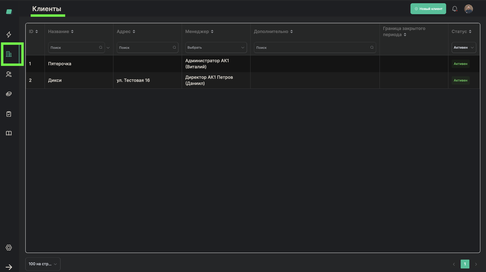
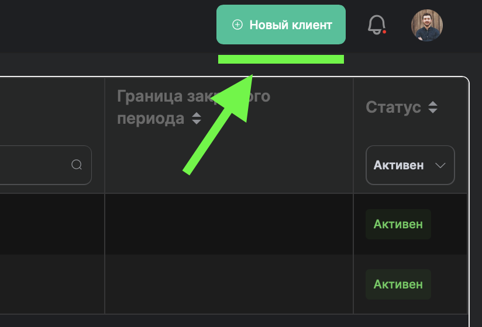
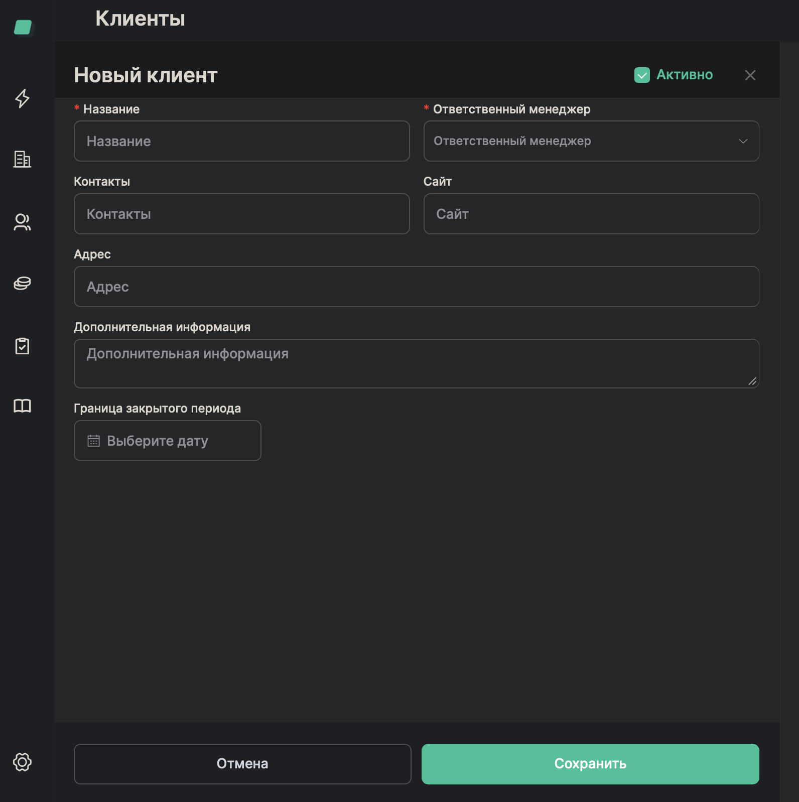
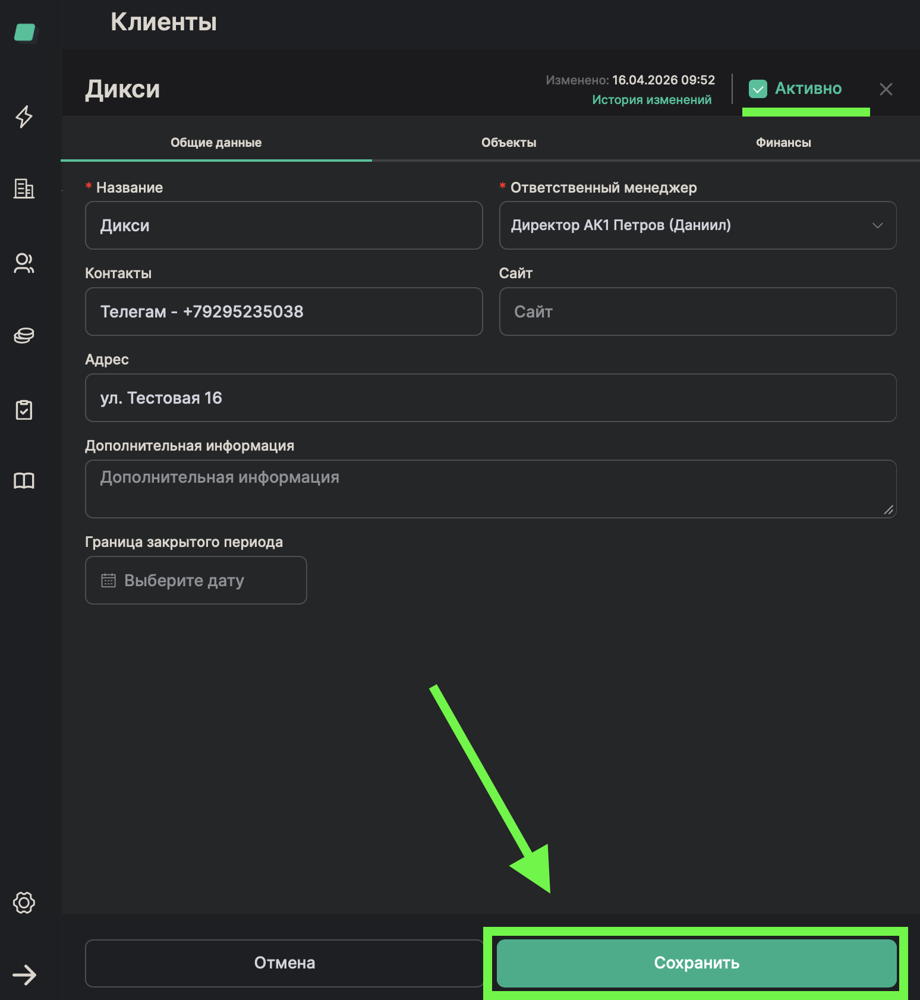

# Добавление клиента

> **Роль:** Менеджер отдела реализации
> **Время:** ~3 минуты
> **Результат:** Новый клиент появится в списке клиентов

---

## Когда это нужно

Вы подписали договор с новым клиентом. Теперь нужно завести его в систему, чтобы потом создавать заказы и заявки на работников.

## Что понадобится

- Договор с клиентом (или данные из договора)
- Название компании клиента
- Контакты клиента (телефон, email)

---

## Шаги

### Шаг 1. Откройте раздел "Клиенты"

В боковом меню нажмите на второй пункт — **"Клиенты"**.

---

### Шаг 2. Нажмите "Новый клиент"

В правом верхнем углу страницы нажмите кнопку **"Новый клиент"**.

---

### Шаг 3. Введите название компании

В поле **"Название компании"** введите название организации клиента.

---

### Шаг 4. Выберите ответственного менеджера

В поле **"Ответственный менеджер"** выберите себя из списка. Ответственный менеджер — это тот, кто общается с этим клиентом и отвечает за его заказы.

> **Обратите внимание:** Обязательно укажите ответственного менеджера. Без него другие сотрудники не будут знать, к кому обращаться по вопросам этого клиента.

---

### Шаг 5. Заполните контакты клиента

Укажите контактные данные клиента:
- **Телефон** — номер телефона контактного лица
- **Email** — электронная почта (если есть)

Можно указать также ссылку на WhatsApp или Telegram.

---

### Шаг 6. Заполните дополнительные поля (необязательно)

При необходимости заполните:
- **Сайт клиента** — адрес сайта компании
- **Адрес** — юридический или фактический адрес
- **Доп. информация** — любые заметки, которые пригодятся коллегам

---

### Шаг 7. Сохраните клиента

Нажмите кнопку **"Сохранить"** внизу формы.

---

## Готово!

Клиент появился в списке на странице "Клиенты". Теперь можно добавлять его объекты (магазины, склады, офисы).

## Если что-то пошло не так

| Проблема | Что делать |
|----------|------------|
| Не могу найти себя в списке ответственных менеджеров | Обратитесь к администратору системы — возможно, ваш аккаунт не настроен |
| Клиент с таким названием уже существует | Проверьте список клиентов — возможно, его уже завёл другой менеджер |
| Кнопка "Сохранить" не активна | Проверьте, что заполнены все обязательные поля (название компании, ответственный менеджер) |

---

*Следующий процесс: [Добавить объект клиента](./02-add-client-object.md)*
