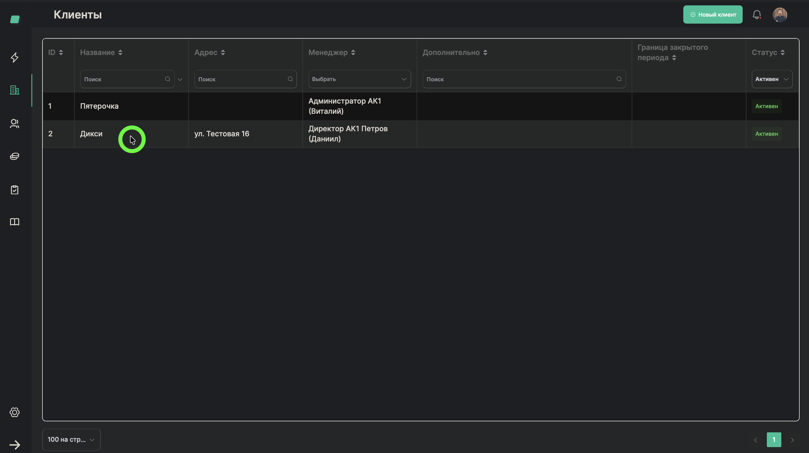
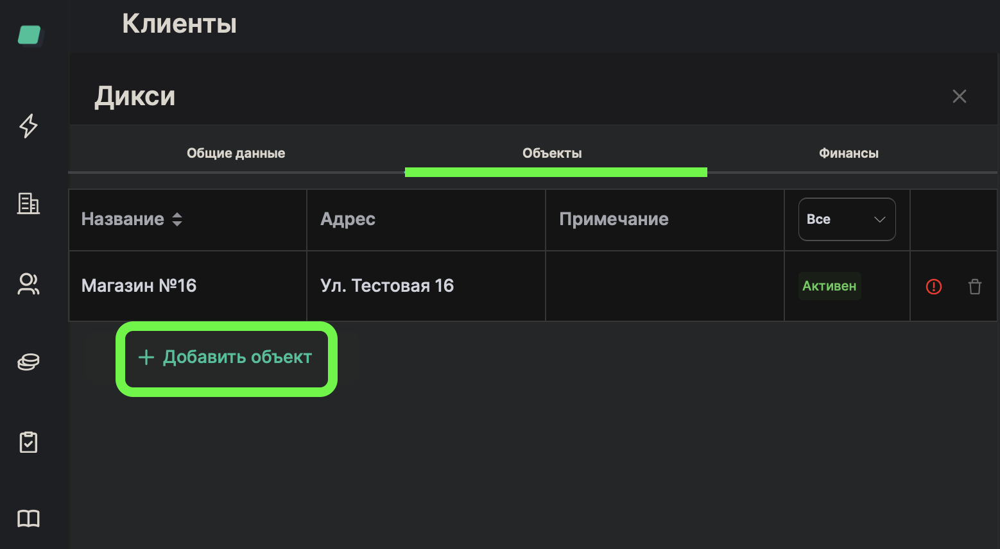
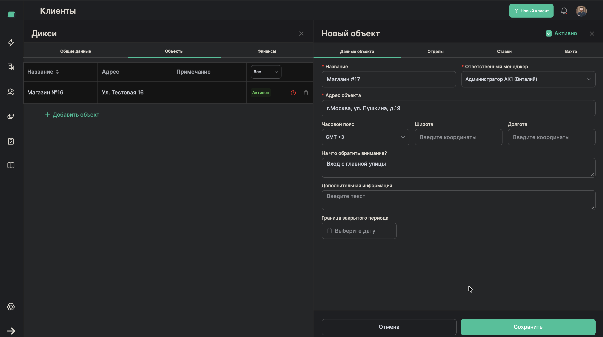
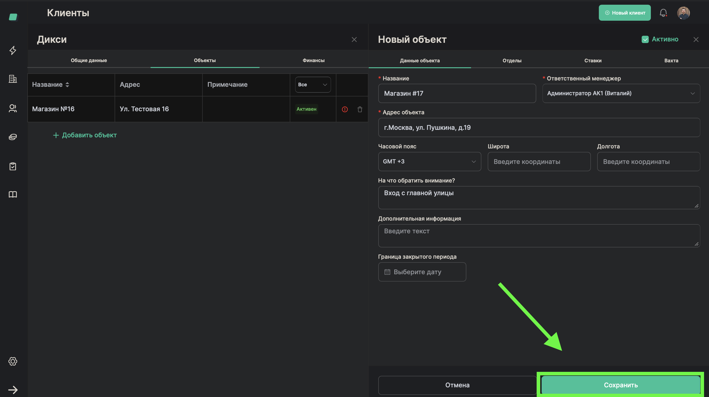

# Добавление объекта клиента

> **Роль:** Менеджер отдела реализации
> **Время:** ~2 минуты
> **Результат:** У клиента появится новый объект (магазин, склад, офис)

---

## Когда это нужно

Вы завели клиента в системе. Теперь нужно добавить его объекты — конкретные точки, куда будут выходить работники. Например: "Магазин №16", "Склад Южный", "Офис на Тверской".

У одного клиента может быть несколько объектов.

## Что понадобится

- Клиент уже добавлен в систему (процесс [01-add-client](./01-add-client.md))
- Название объекта
- Адрес объекта

---

## Шаги

### Шаг 1. Откройте карточку клиента

На странице **"Клиенты"** найдите нужного клиента в списке и нажмите на него.

---

### Шаг 2. Нажмите "Добавить объект"

В карточке клиента найдите блок с объектами и нажмите кнопку добавления нового объекта.

---

### Шаг 3. Введите название объекта

В поле **"Название объекта"** введите понятное название. Например: "Магазин №16" или "Склад Южный".

> **Обратите внимание:** Давайте объекту такое название, по которому все сразу поймут, о каком месте идёт речь.

---

### Шаг 4. Выберите ответственного менеджера

Укажите, кто отвечает за этот объект. Обычно это тот же менеджер, который ведёт клиента.

---

### Шаг 5. Введите адрес объекта

В поле **"Адрес"** введите полный адрес объекта. Это важно — по этому адресу работники будут приезжать на смену.

---

### Шаг 6. Заполните дополнительные поля (необязательно)

- **Часовой пояс** — если объект в другом регионе
- **На что обратить внимание** — важные заметки для работников и бригадиров. Например: "Вход через чёрный ход", "Пропуск оформляется на КПП"

> **Обратите внимание:** Если вы заполните поле "На что обратить внимание", эта информация будет показываться всем, кто открывает объект. Это удобно для передачи важных деталей.

---

### Шаг 7. Сохраните объект

Нажмите кнопку **"Сохранить"**.

---

## Готово!

Объект появился в карточке клиента. При открытии объекта будет видно модальное окно с информацией "На что обратить внимание" (если вы его заполнили).

Теперь можно добавить подразделения и настроить расценки.

## Если что-то пошло не так

| Проблема | Что делать |
|----------|------------|
| Не вижу кнопку добавления объекта | Убедитесь, что вы открыли карточку клиента, а не просто список |
| Объект не сохраняется | Проверьте, что заполнены обязательные поля: название и адрес |

---

*Предыдущий процесс: [Добавить клиента](./01-add-client.md)*
*Следующий процесс: [Добавить подразделение](./03-add-department.md)*
