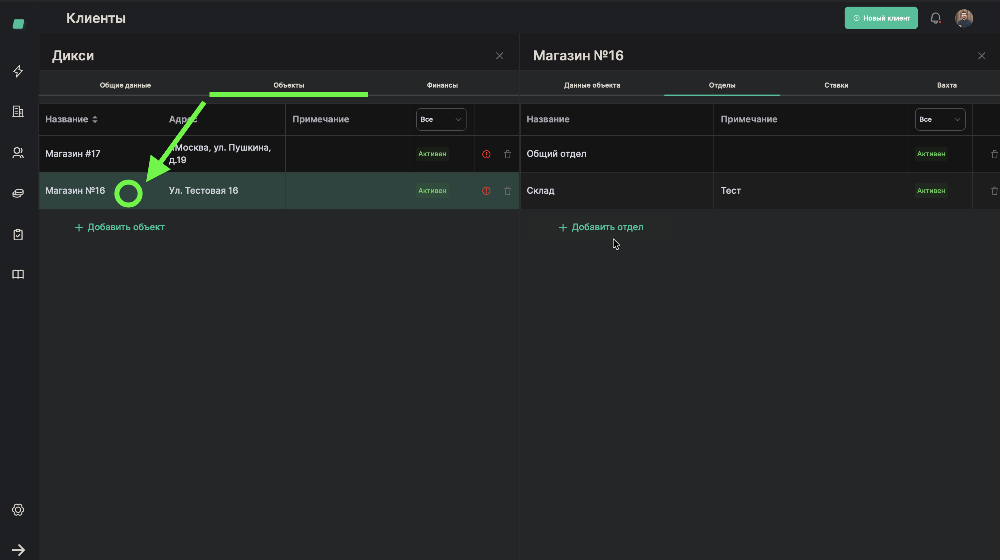
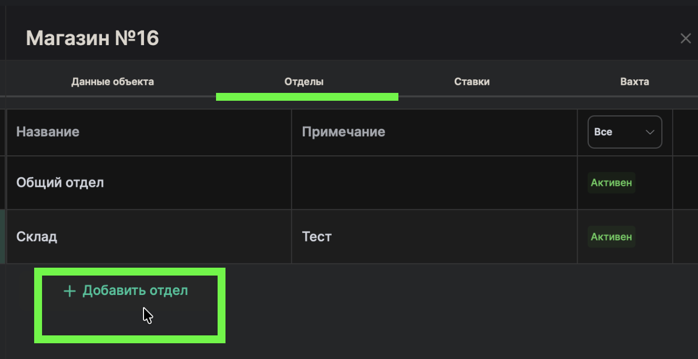
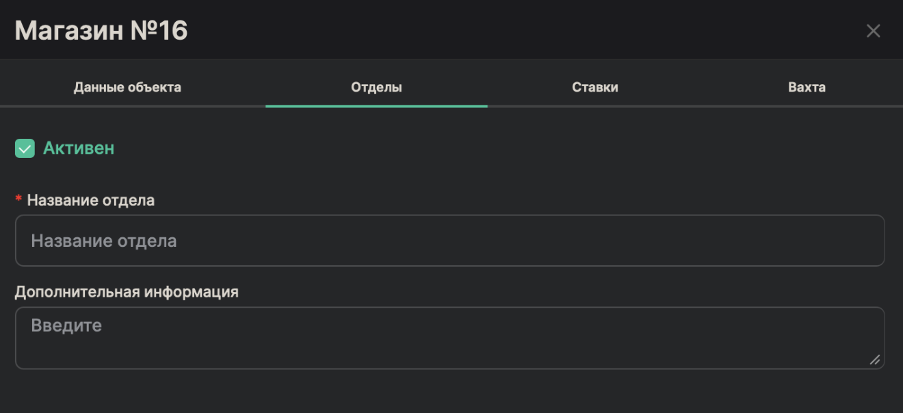
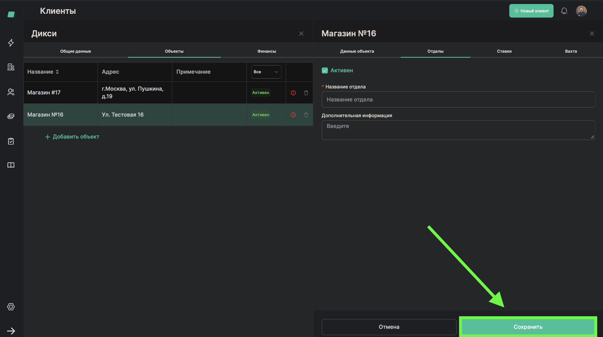

# Добавление подразделения

> **Роль:** Менеджер отдела реализации
> **Время:** ~1 минута
> **Результат:** В объекте появится новое подразделение (отдел)

---

## Когда это нужно

Вы добавили объект клиента (например, "Магазин №17"). Теперь нужно разбить его на подразделения — это отделы внутри объекта, где работают разные специалисты.

Например, в магазине могут быть подразделения:
- **Склад** — сюда нужны грузчики
- **Торговый зал** — сюда нужны продавцы-консультанты
- **Касса** — сюда нужны кассиры

У одного объекта может быть несколько подразделений.

## Что понадобится

- Объект уже добавлен (процесс [02-add-client-object](./02-add-client-object.md))

---

## Шаги

### Шаг 1. Откройте карточку объекта

В карточке клиента нажмите на нужный объект.

---

### Шаг 2. Нажмите "Добавить подразделение"

Найдите блок подразделений и нажмите кнопку добавления.

---

### Шаг 3. Введите название подразделения

В поле **"Название"** введите название отдела. Например: "Склад", "Торговый зал", "Кухня".

---

### Шаг 4. Добавьте комментарий (необязательно)

Если есть важная информация по этому подразделению, напишите её в поле **"Дополнительная информация"**.

---

### Шаг 5. Сохраните подразделение

Нажмите **"Сохранить"**.

---

## Готово!

Подразделение появилось в карточке объекта. В списке подразделений видно его название и примечания.

Теперь можно настроить расценки (ставки) для специалистов в этом подразделении.

## Если что-то пошло не так

| Проблема | Что делать |
|----------|------------|
| Не вижу кнопку добавления | Убедитесь, что вы внутри карточки конкретного объекта |

---

Вернуться к [обзору роли](./README.md).
