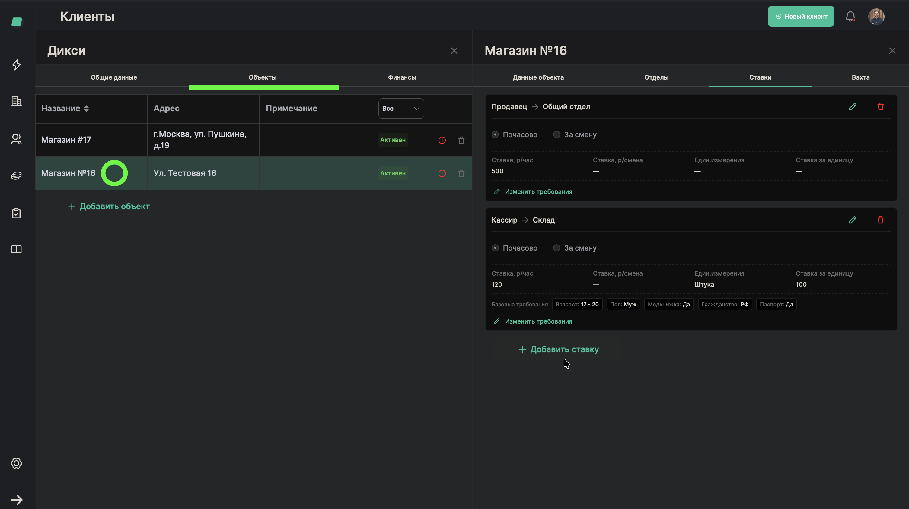
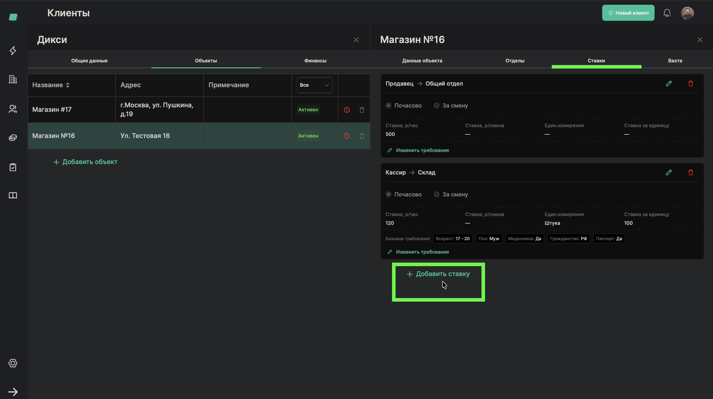
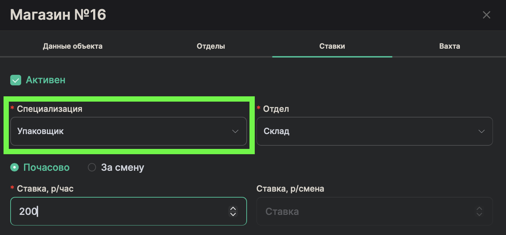
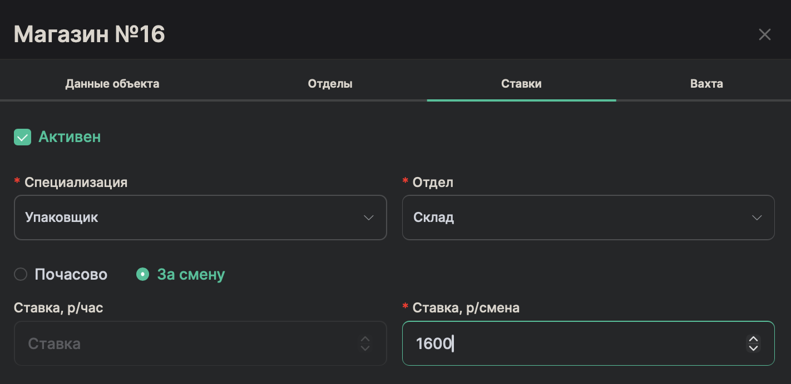
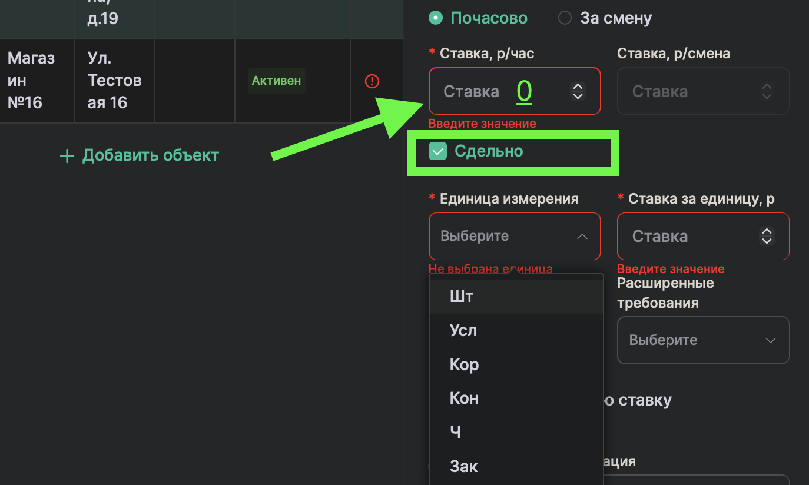
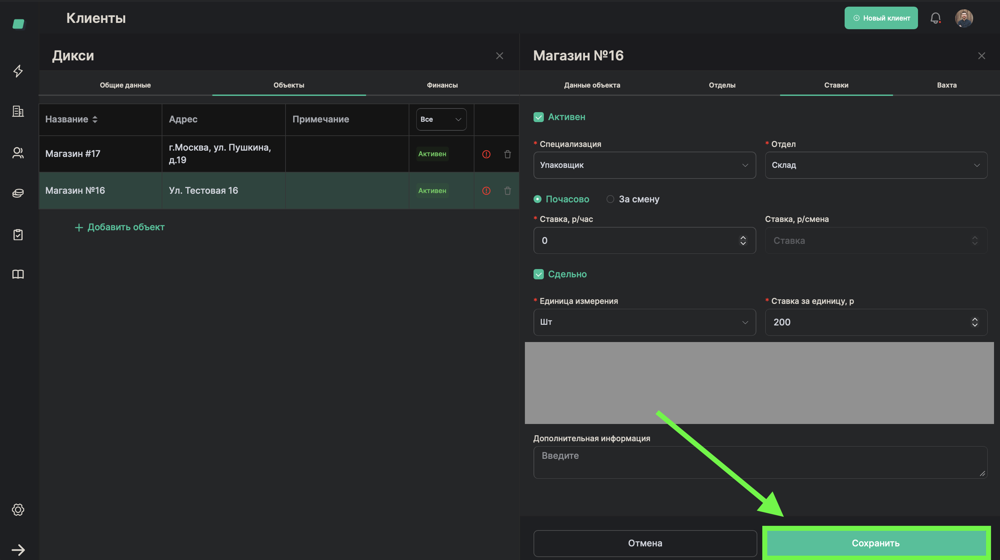

# Установка расценок (ставок)

> **Роль:** Менеджер отдела реализации
> **Время:** ~2 минуты
> **Результат:** Для объекта будут заданы ставки оплаты по специализациям

---

## Когда это нужно

Вы добавили объект и подразделения. Теперь нужно указать, сколько платят работникам за час (или за штуку). Это важно: от ставки зависит, сколько получит исполнитель за смену.

Ставка — это комбинация: **специализация** + **подразделение** + **цена**.

Примеры:
- Продавец в Торговом зале — 500 руб/час
- Грузчик на Складе — 400 руб/час
- Кассир на Кассе — 450 руб/час

## Что понадобится

- Объект и подразделения (отделы) уже добавлены
- Информация из договора: какие специалисты нужны и какая ставка

---

## Шаги

### Шаг 1. Откройте карточку объекта

В карточке клиента нажмите на нужный объект.

---

### Шаг 2. Нажмите "Добавить ставку"

Найдите блок ставок и нажмите кнопку добавления.

---

### Шаг 3. Выберите специализацию

В выпадающем списке выберите, какой специалист нужен. Например: **"Продавец"**, **"Грузчик"**, **"Кассир"**.

> **Обратите внимание:** Если нужной специализации нет в списке — значит, она еще не настроена. Обратитесь к администратору — нужно добавить специализацию в справочник.

---

### Шаг 4. Введите ставку

В поле ставки введите сумму. Например: **500** (рублей в час).

> **Обратите внимание:** Есть два типа оплаты:
> - **Почасовая** — платим за каждый отработанный час (например, 500 руб/час)
> - **Сдельная** — платим за штуку/коробку/единицу (например, 50 руб/коробка)
>
> Тип "За смену" сейчас неактуален и не используется.

Если ставка сдельная, укажите единицу измерения и ставку за единицу.

> **Обратите внимание:** Если выбрана сдельная ставка, укажите "0" в почасовой ставке/ставке за смену.

| Сокращение | Полное название | Описание |
|------------|-----------------|----------|
| Шт | Штука | Оплата за каждую обработанную единицу товара (например, выкладка 1 товара) |
| Усл | Услуга | Оплата за оказанную услугу целиком |
| Кор | Коробка | Оплата за обработку/разгрузку одной коробки |
| Кон | Контейнер | Оплата за обработку одного контейнера или паллета |
| Ч | Час | Оплата за отработанный час (почасовая, но в рамках сдельного блока) |
| Зак | Заказ | Оплата за выполненный заказ целиком |

---

### Шаг 5. Сохраните ставку

Нажмите **"Сохранить"**.

---

## Готово!

Ставка появилась в карточке объекта. При создании заявки система будет использовать эту ставку для расчёта оплаты.

Повторите процесс для каждой комбинации "специализация + отдел", которая нужна на этом объекте.

## Если что-то пошло не так

| Проблема | Что делать |
|----------|------------|
| Нет нужной специализации в списке | Обратитесь к администратору — нужно добавить специализацию в справочник |
| Не могу выбрать подразделение | Проверьте, что подразделение уже создано (процесс [03](./03-add-department.md)) |
| Не могу поставить сдельную ставку, требуется указать ставку за час/смену | Установите значение "0" |
| Отсутствует нужная единица измерения | Обратитесь к администратору — нужно добавить единицу измерения в справочник |

---

Вернуться к [обзору роли](./README.md).
