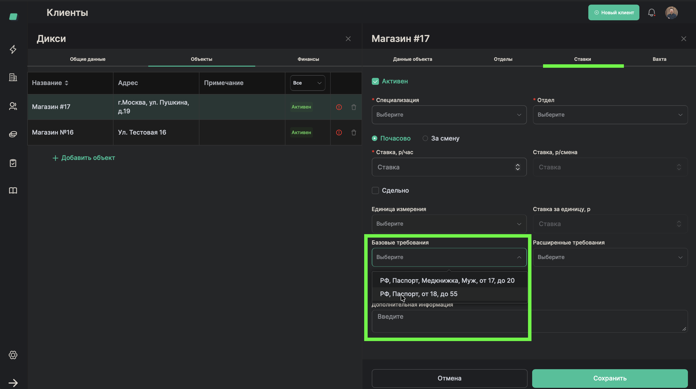
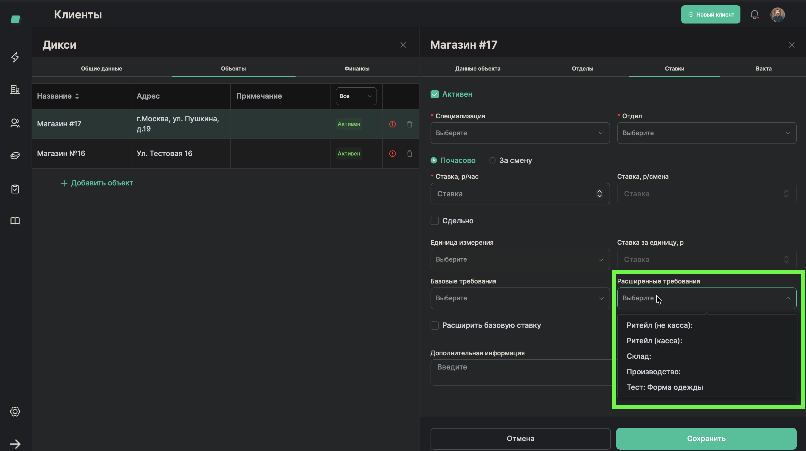
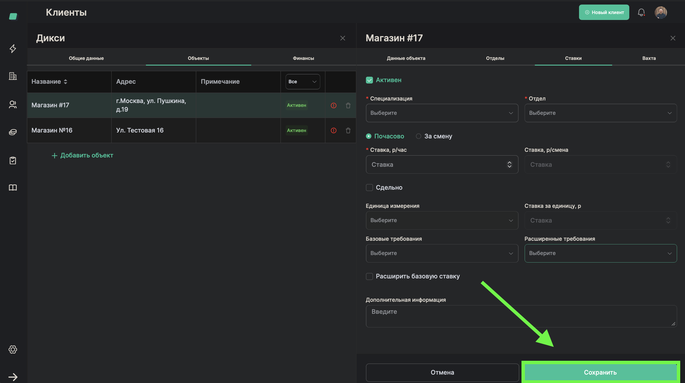

# Установка требований к работникам

> **Роль:** Менеджер отдела реализации
> **Время:** ~3 минуты
> **Результат:** Для объекта будут заданы требования к работникам (пол, возраст, документы и т.д.)

---

## Когда это нужно

У разных клиентов разные требования к работникам. Например:
- На продуктовый склад нужны мужчины с медкнижкой
- В торговый зал — девушки определённого возраста
- На стройку — только граждане РФ

Требования бывают двух видов:
- **Базовые** — пол, возраст, гражданство, наличие паспорта, медкнижка
- **Расширенные** — особые требования клиента (татуировки, внешний вид и т.д.)

## Что понадобится

- Объект уже добавлен (процесс [02-add-client-object](./02-add-client-object.md))
- Информация из договора о требованиях к персоналу

---

## Шаги

### Базовые требования

### Шаг 1. Откройте настройки объекта

В карточке объекта найдите блок **"Базовые требования"**.

---

### Шаг 2. Создайте набор требований

Нажмите кнопку добавления. Откроется форма для создания набора базовых требований.

---

### Шаг 3. Заполните базовые параметры

Укажите:
- **Название набора** — например: "Стандарт для склада"
- **Пол** — мужской / женский / любой
- **Возраст** — от и до (например, от 18 до 45)
- **Гражданство** — например: РФ
- **Наличие медкнижки** — нужна ли с первой смены

---

### Шаг 4. Сохраните набор

Нажмите **"Сохранить"**.

---

### Расширенные требования

### Шаг 5. Откройте расширенные требования

Если клиенту нужны особые требования, перейдите в блок **"Расширенные требования"**.

---

### Шаг 6. Выберите требование из списка

В форме расширенных требований выберите подходящий пункт из предложенного списка. Например:
- Татуировки — строго скрытые
- Форма одежды
- Другие особые требования клиента

---

### Шаг 7. Сохраните

Нажмите **"Сохранить"**.

---

## Готово!

Требования привязаны к объекту. Когда вы будете создавать заявку, система автоматически подтянет требования из ставки.

Это значит, что при назначении работников система сможет проверять, подходит ли конкретный человек под требования объекта.

## Если что-то пошло не так

| Проблема | Что делать |
|----------|------------|
| В списке расширенных требований нет нужного пункта | Обратитесь к администратору — нужно добавить пункт в справочник |
| Требования не подтягиваются при создании заявки | Убедитесь, что требования привязаны к той же ставке (специализация + подразделение), которую вы используете в заявке |

---

*Предыдущий процесс: [Установить расценки](./04-set-rates.md)*
*Следующий процесс: [Создать заказ](./06-create-order.md)*
