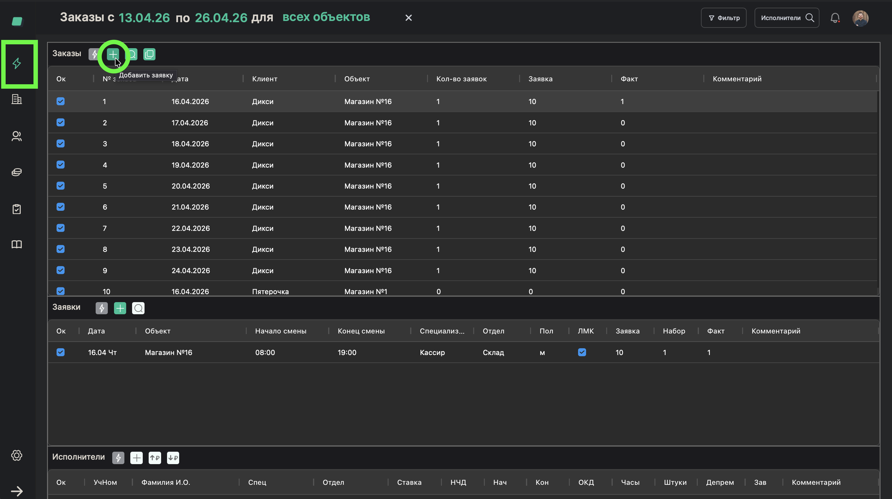
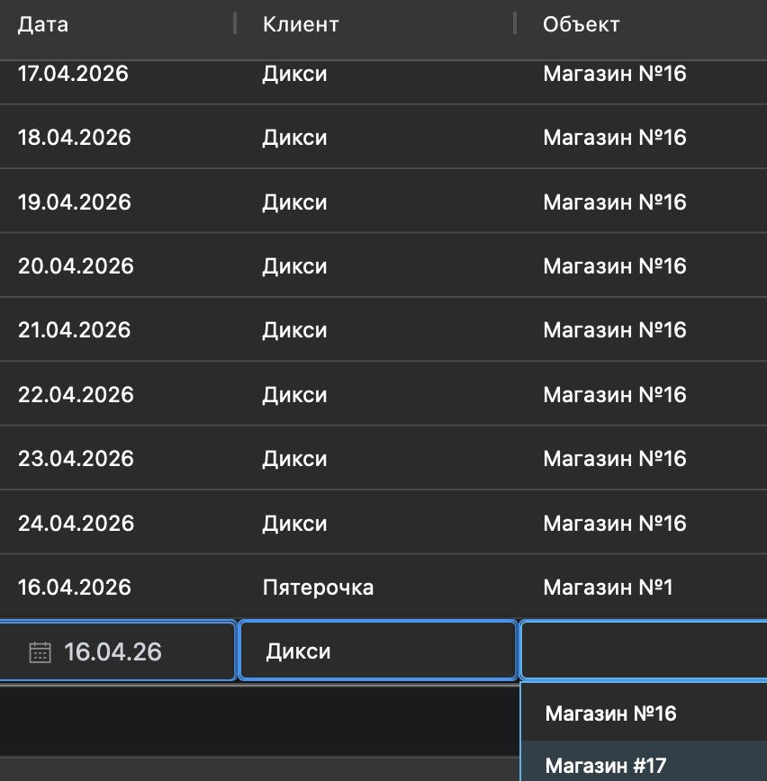

# Создание заказа

> **Роль:** Менеджер отдела реализации
> **Время:** ~2 минуты
> **Результат:** В системе появится новый заказ на конкретный объект и дату

---

## Когда это нужно

Клиент прислал заявку на работников (по email, WhatsApp или другим способом). Вам нужно создать заказ в системе, чтобы потом добавить в него заявки на конкретные смены.

**Заказ** — это "контейнер" для одного дня работы на одном объекте клиента. Внутри заказа будут заявки с деталями: какие специалисты нужны, сколько человек, на какое время.

## Что понадобится

- Клиент, объект и подразделения уже добавлены (процессы [01](./01-add-client.md)-[05](./05-set-requirements.md))
- Информация от клиента: на какой объект, на какую дату нужны люди

---

## Шаги

### Шаг 1. Нажмите "Новый заказ"

На главной странице (таблица заказов) нажмите кнопку **"Новый заказ"** (или найдите пункт в меню).

---

### Шаг 2. Выберите клиента

В поле **"Клиент"** выберите нужного клиента из выпадающего списка.

---

### Шаг 3. Выберите объект

В поле **"Объект"** выберите конкретный объект клиента. Например: "Магазин №16".

---

### Шаг 4. Укажите дату заказа

Выберите дату, на которую клиент запросил работников.

---

### Шаг 5. Сохраните заказ

Нажмите **"Сохранить"**.

---

## Готово!

Заказ создан и появился в таблице заказов. Теперь нужно добавить в него заявки — конкретные смены с указанием специализации и количества людей.

## Если что-то пошло не так

| Проблема | Что делать |
|----------|------------|
| Не могу найти клиента в списке | Возможно, клиент ещё не добавлен — см. процесс [01](./01-add-client.md) |
| Не могу найти объект | Возможно, объект ещё не добавлен — см. процесс [02](./02-add-client-object.md) |
| Нужно создать заказы на несколько дней | Создайте один заказ, а потом скопируйте его — см. процесс [08](./08-copy-order.md) |

---

*Предыдущий процесс: [Установить требования к работникам](./05-set-requirements.md)*
*Следующий процесс: [Создать заявку в заказе](./07-create-request.md)*
