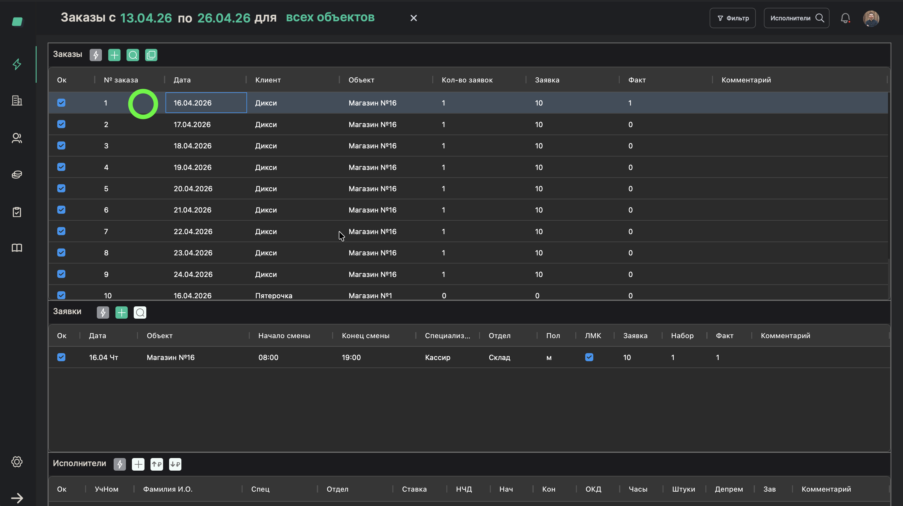
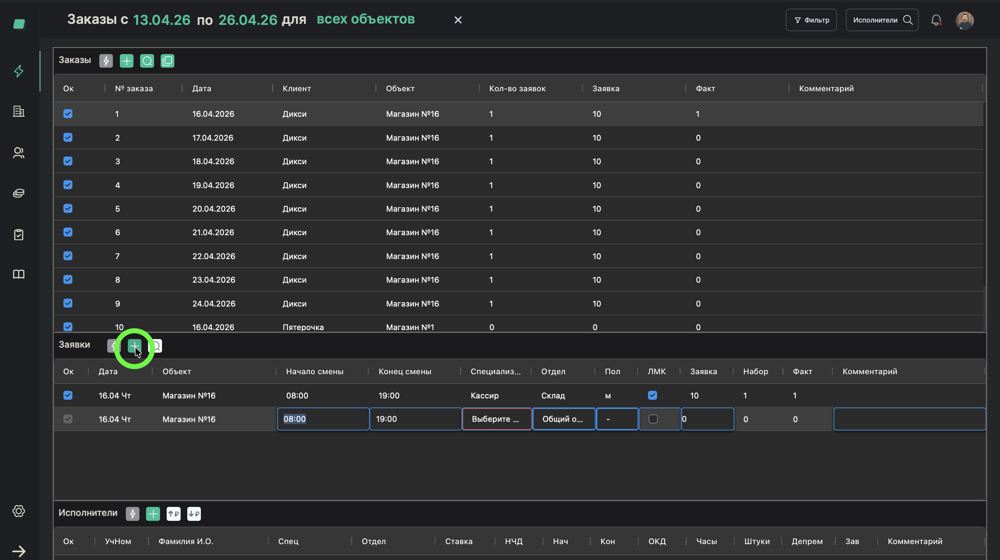

# Создание заявки в заказе

> **Роль:** Менеджер отдела реализации
> **Время:** ~2 минуты
> **Результат:** В заказе появится заявка с указанием смены, специализации и количества людей

---

## Когда это нужно

Вы создали заказ. Теперь нужно указать, какие именно работники нужны: какая специализация, в какое время, сколько человек.

**Заявка** — это конкретный запрос внутри заказа. Например: "10 грузчиков на склад с 8:00 до 20:00". Один заказ может содержать несколько заявок — на разные подразделения, специализации и время.

## Что понадобится

- Заказ уже создан (процесс [06](./06-create-order.md))
- Ставки настроены (процесс [04](./04-set-rates.md))
- Информация от клиента: сколько людей, каких специалистов, на какое время

---

## Шаги

### Шаг 1. Откройте заказ

В таблице заказов нажмите на нужный заказ.

---

### Шаг 2. Нажмите "Добавить заявку"

Внутри карточки заказа нажмите кнопку добавления заявки.

---

### Шаг 3. Выберите специализацию

В поле **"Специализация"** выберите, какой специалист нужен. Например: "Продавец", "Грузчик", "Кассир".

> **Обратите внимание:** Список специализаций зависит от того, какие ставки вы настроили для этого объекта. Если нужной специализации нет — сначала добавьте ставку (процесс [04](./04-set-rates.md)).

---

### Шаг 4. Выберите подразделение

Подразделение (отдел) подтянется автоматически на основе комбинации "специализация + объект". Если для одной специализации доступно несколько подразделений, выберите нужное.

---

### Шаг 5. Укажите начало и конец смены

Заполните:
- **Начало смены** — время начала работы (например, 08:00)
- **Окончание смены** — время окончания работы (например, 20:00)

---

### Шаг 6. Укажите количество людей

В поле **"Количество"** введите, сколько работников нужно на эту смену.

---

### Шаг 7. Укажите дополнительные параметры (при необходимости)

- **Пол** — если нужен конкретный пол (мужской/женский)
- **Медкнижка** — нужна ли медицинская книжка

---

### Шаг 8. Сохраните заявку

Нажмите **"Сохранить"**.

---

## Готово!

Заявка появилась в заказе. Вы увидите колонки:
- **Заявка** — сколько людей запросили (план)
- **Набор** — сколько людей назначено
- **Факт** — сколько людей реально вышло

Сейчас "Набор" и "Факт" будут 0 — работники ещё не назначены.

## Если что-то пошло не так

| Проблема | Что делать |
|----------|------------|
| Нет нужной специализации | Добавьте ставку с этой специализацией — процесс [04](./04-set-rates.md) |
| Подразделение не подтягивается | Проверьте, что ставка настроена именно для этой комбинации специализации и подразделения |
| Нужно несколько заявок в один заказ | Повторите процесс — в одном заказе может быть много заявок |

---

*Предыдущий процесс: [Создать заказ](./06-create-order.md)*
*Следующий процесс: [Скопировать заказ на следующую неделю](./08-copy-order.md)*
