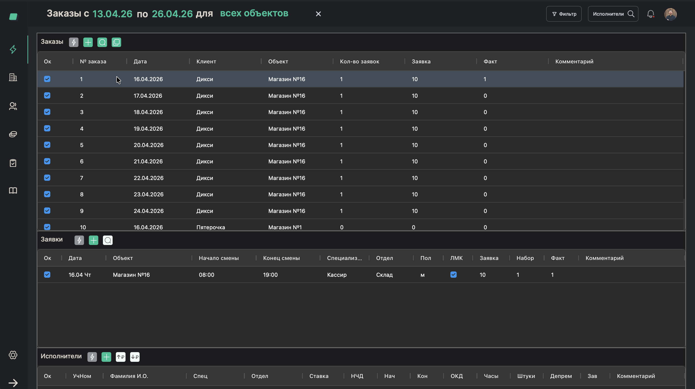
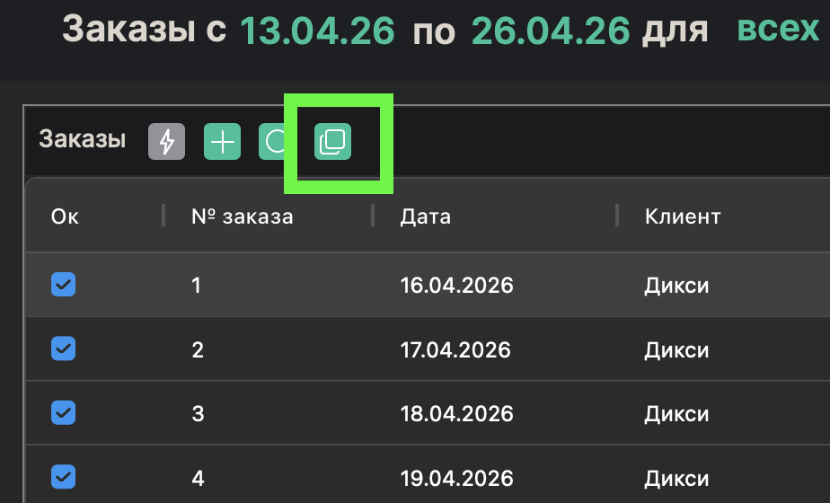
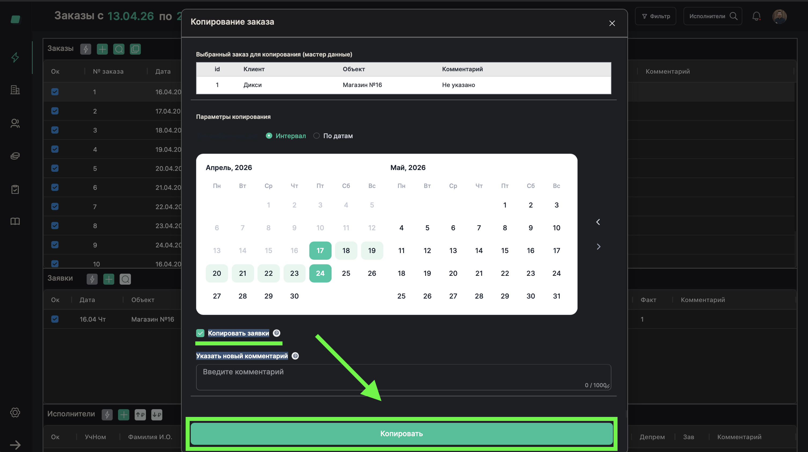

# Копирование заказа на следующую неделю

> **Роль:** Менеджер отдела реализации
> **Время:** ~1 минута
> **Результат:** Заказы с заявками продублированы на выбранные даты

---

## Когда это нужно

У многих клиентов заявки одинаковые каждую неделю — те же объекты, те же смены, то же количество людей. Вместо того чтобы каждый раз создавать заказы вручную, можно скопировать существующий заказ на нужные даты.

Это основная еженедельная операция: каждую неделю вы копируете заказы на следующую.

## Что понадобится

- Уже есть хотя бы один заказ с заявками

---

## Шаги

### Шаг 1. Выберите заказ для копирования

На главной странице (таблица заказов) найдите заказ, который хотите скопировать.

---

### Шаг 2. Нажмите "Копировать"

Нажмите кнопку **"Копировать заказ"**.

---

### Шаг 3. Выберите диапазон дат

Укажите даты, на которые нужно скопировать заказ. Например, выберите период с понедельника по воскресенье следующей недели.

Система создаст отдельный заказ на каждую выбранную дату.

---

### Шаг 4. Подтвердите копирование

Нажмите **"Копировать"** (или **"Подтвердить"**).

---

## Готово!

В таблице заказов появились новые заказы — по одному на каждую выбранную дату. Все заявки из исходного заказа скопированы: те же специализации, те же смены, то же количество людей.

Теперь бригадиры могут начинать назначать работников на эти заказы.

> **Обратите внимание:** Если клиент присылает корректировки (например, на среду нужно не 10, а 8 грузчиков), отредактируйте заявку в конкретном заказе на среду. Остальные дни останутся без изменений.

## Если что-то пошло не так

| Проблема | Что делать |
|----------|------------|
| Заказы не появились после копирования | Проверьте фильтры на главной странице — возможно, выбран другой период |
| Нужно скопировать только часть заявок | Скопируйте весь заказ, затем откройте копию и удалите ненужные заявки |

---

Вернуться к [обзору роли](./README.md).
