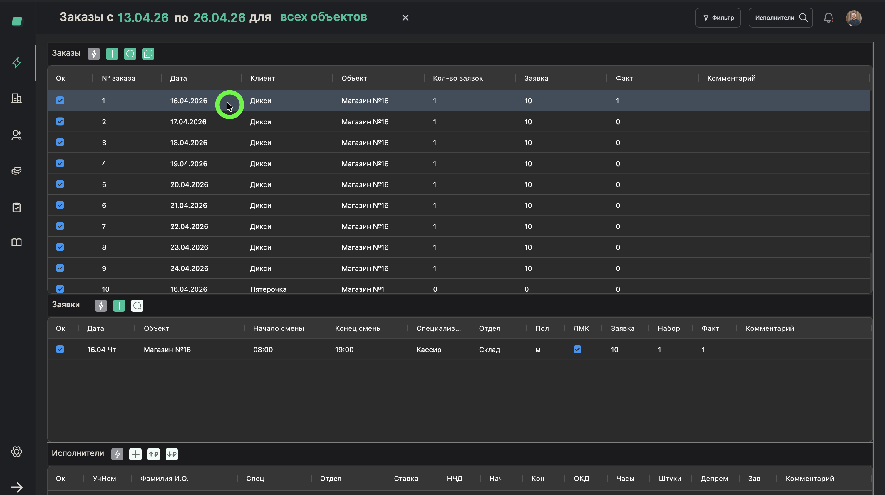
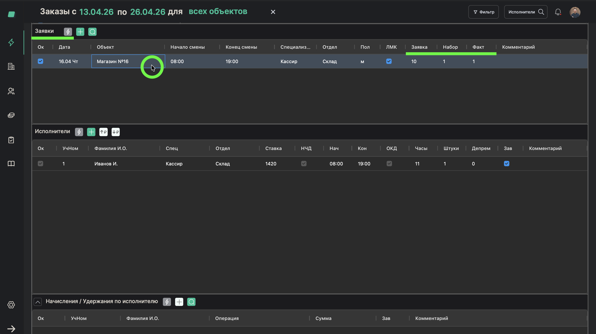
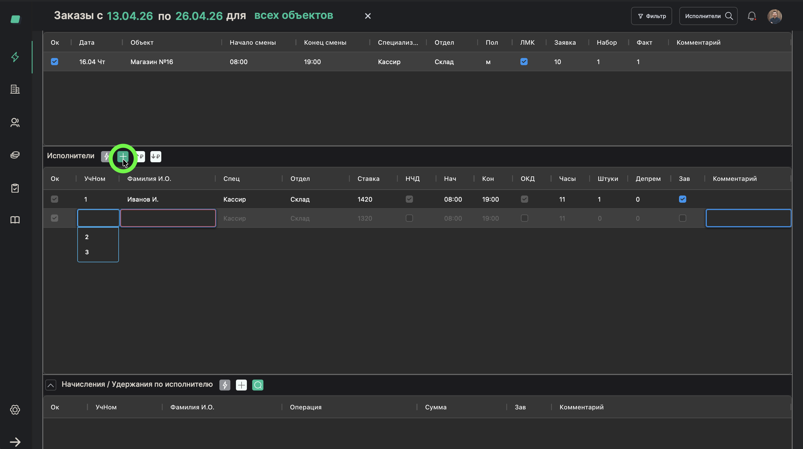
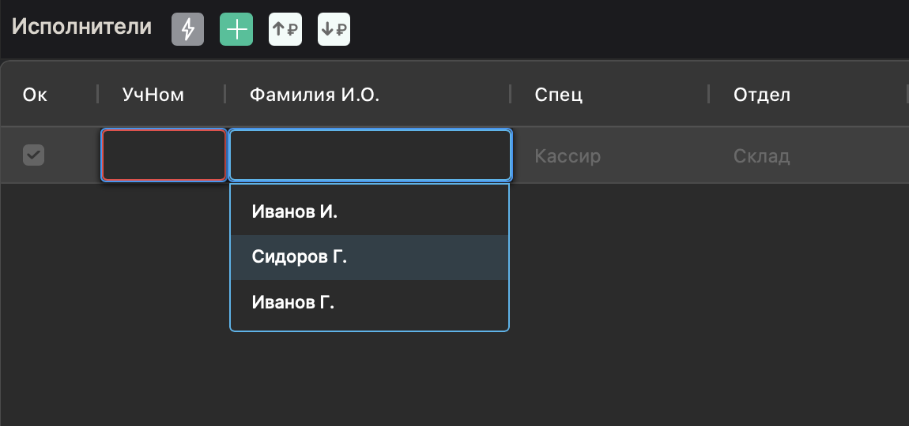
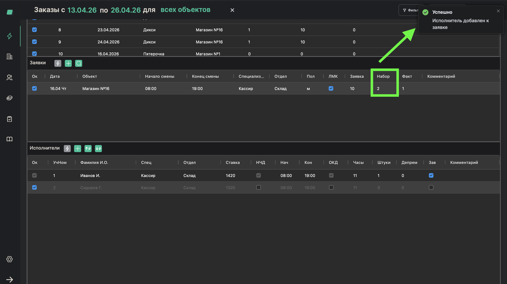

# Назначение исполнителей на заявку

> **Роль:** Менеджер отдела реализации
> **Время:** ~2 минуты
> **Результат:** Работники назначены на конкретную смену

---

## Когда это нужно

Заказ и заявка созданы. Теперь нужно назначить конкретных людей на смену.

**Кто обычно этим занимается:**
- В первую очередь — **бригадир**. Это его основная задача: раз в неделю (до четверга) распланировать всех работников.
- Если бригадир не справился — подключается **менеджер отдела персонала**.
- **Менеджер отдела реализации** тоже может назначать работников, особенно если он знает людей на объекте.

Ваша главная задача — убедиться, что заявки закрыты. Если бригадир не справился — можете помочь, назначив работников самостоятельно.

## Что понадобится

- Заказ с заявкой уже созданы
- Работники (исполнители) уже добавлены в систему

---

## Шаги

### Шаг 1. Откройте заказ

В таблице заказов нажмите на нужный заказ.

---

### Шаг 2. Найдите заявку

В карточке заказа найдите заявку, на которую нужно назначить работников. Обратите внимание на колонки:
- **Заявка** — сколько людей нужно
- **Набор** — сколько уже назначено
- **Факт** — сколько реально вышло

---

### Шаг 3. Нажмите "Назначить исполнителя"

Нажмите кнопку добавления исполнителя к заявке.

---

### Шаг 4. Найдите и выберите работника

В боковой панели найдите работника. Можно искать по имени, фамилии или телефону.

> **Обратите внимание:** Один и тот же работник не может быть назначен на две перекрывающиеся по времени смены. Система предупредит, если возникнет конфликт.

---

### Шаг 5. Подтвердите назначение

Выберите работника из списка. Он будет добавлен в заявку.

---

## Готово!

Работник назначен на смену. В колонке **"Набор"** число увеличилось. Повторите для каждого работника, пока "Набор" не сравняется с "Заявка".

## Если что-то пошло не так

| Проблема | Что делать |
|----------|------------|
| Не могу найти работника | Возможно, он ещё не добавлен в систему — обратитесь к менеджеру отдела персонала |
| Хочу удалить назначенного работника | Можно удалить, если до начала смены больше 24 часов. Если менее 24 часов — удаление недоступно |
| Работника назначили не на ту смену | Удалите его из текущей заявки и назначьте на правильную |

---

*Предыдущий процесс: [Скопировать заказ](./08-copy-order.md)*
*Следующий процесс: [Проверить выходы: план и факт](./10-monitor-fulfillment.md)*
