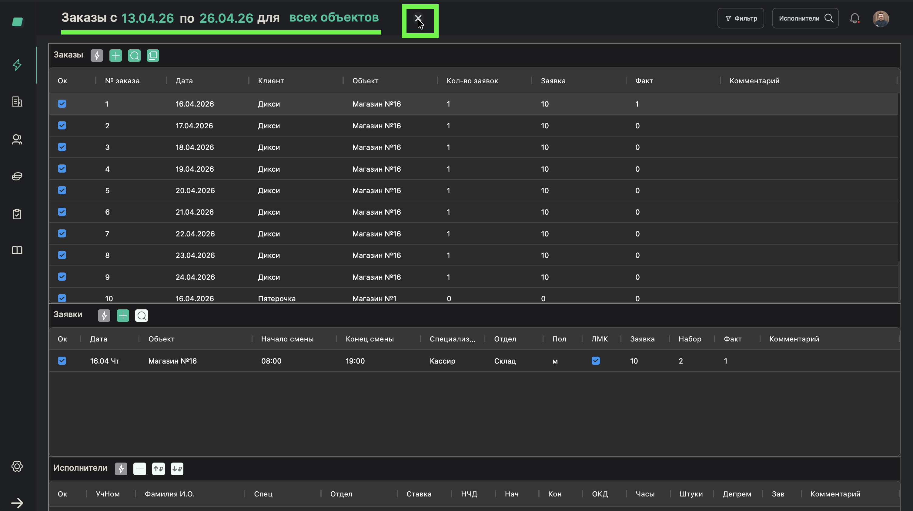
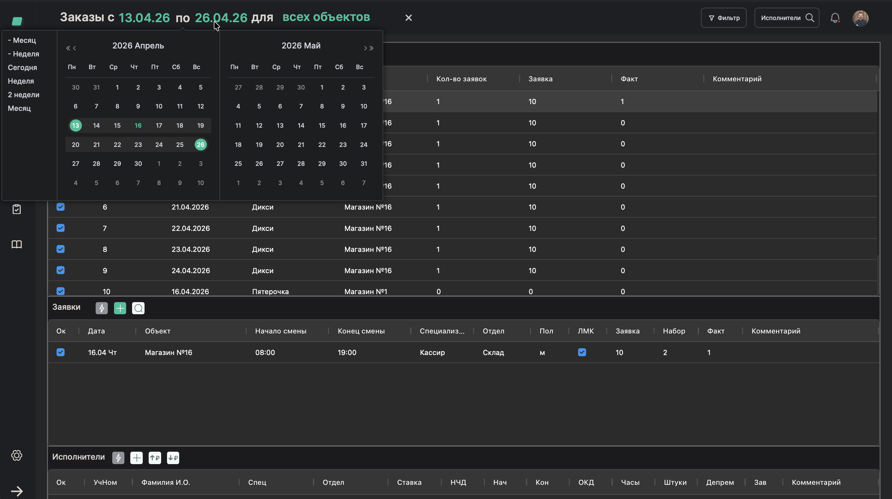
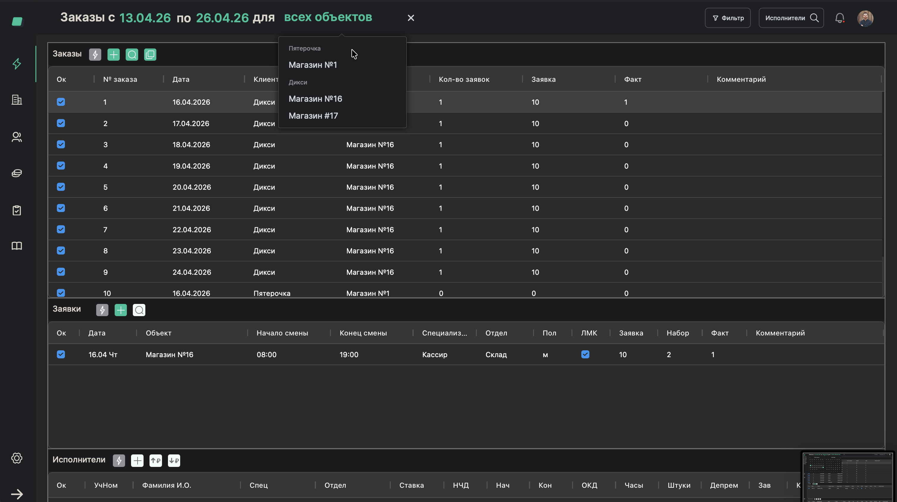
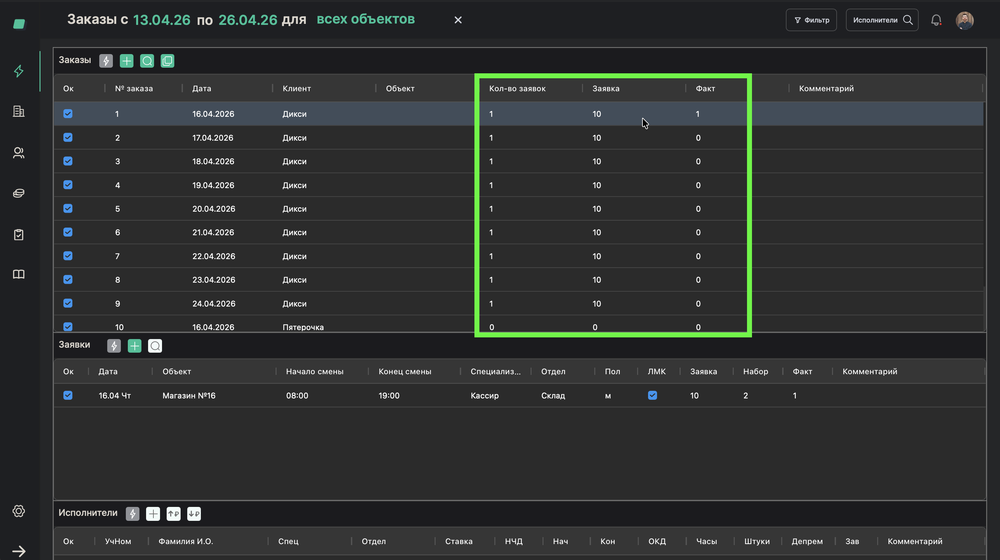

# Проверка выходов: план и факт

> **Роль:** Менеджер отдела реализации
> **Время:** ~5 минут (ежедневная проверка)
> **Результат:** Вы понимаете, какие заказы закрыты, а какие требуют внимания

---

## Когда это нужно

Каждый день (или несколько раз в день) менеджер проверяет, все ли заказы закрыты:
- Все ли работники назначены?
- Все ли вышли на смену?

Если заказ не закрыт — клиент может выставить штраф. Поэтому мониторинг — одна из ключевых ежедневных задач.

## Что понадобится

- Созданные заказы с заявками

---

## Шаги

### Шаг 1. Откройте таблицу заказов

На главной странице отображается таблица всех заказов.

> **Обратите внимание:** Вы можете сбросить фильтр, нажав на кнопку "x" в строке фильтра.

---

### Шаг 2. Настройте фильтры

Отфильтруйте заказы, чтобы увидеть нужный период:
- **Период** — выберите нужные даты (например, сегодня или текущая неделя)
- **Объект** — если хотите посмотреть конкретный объект

---

### Шаг 3. Посмотрите на колонки "Заявка" и "Факт"

В каждой строке заказа обратите внимание на цифры:

| Колонка | Что значит |
|---------|-----------|
| **Заявка** | Сколько людей запросил клиент (план) |
| **Набор** | Сколько людей назначено (запланировано) |
| **Факт** | Сколько людей реально вышло на смену |

**Как читать:**
- Заявка: 10, Факт: 10 — всё в порядке, заказ закрыт
- Заявка: 10, Факт: 0 — никто не вышел, нужно срочно разбираться
- Заявка: 10, Набор: 5 — назначена только половина, нужно пнуть бригадира

---

### Шаг 4. Откройте проблемный заказ

Если видите, что "Факт" меньше "Заявки" — нажмите на этот заказ, чтобы увидеть детали: кто назначен, кто не вышел.

---

### Шаг 5. Примите меры

Если заказ не закрыт:
1. Свяжитесь с **бригадиром** — пусть дозвонится до работников
2. Если бригадир не справляется — подключите **менеджера отдела персонала**
3. При необходимости — назначьте работников самостоятельно (процесс [09](./09-assign-workers.md))

---

## Готово!

Вы проверили все заказы и знаете текущую ситуацию. Повторяйте эту проверку ежедневно, особенно ближе к началу смен.

> **Обратите внимание:** Бригадир должен планировать работников **до четверга** на следующую неделю. Если к четвергу заказы не закрыты — это сигнал для действия.

## Если что-то пошло не так

| Проблема | Что делать |
|----------|------------|
| Не вижу заказы за нужный период | Проверьте фильтры — возможно, выбран другой диапазон дат |
| Факт = 0, хотя работники были назначены | Возможно, бригадир ещё не проставил выходы. Смены проставляются через 15 минут после окончания |

---

Вернуться к [обзору роли](./README.md).
